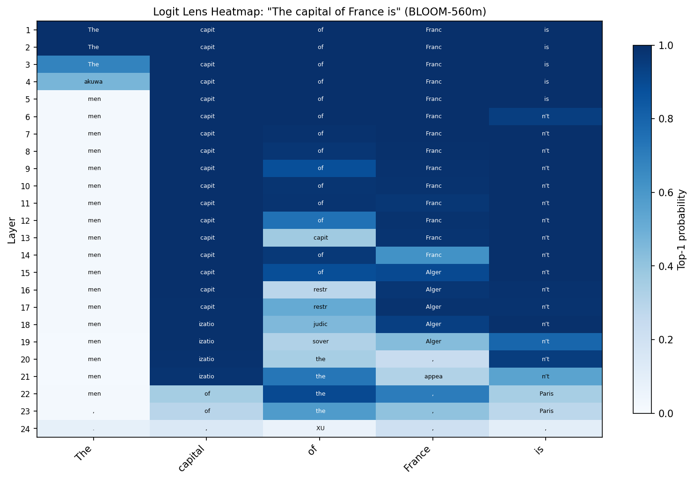
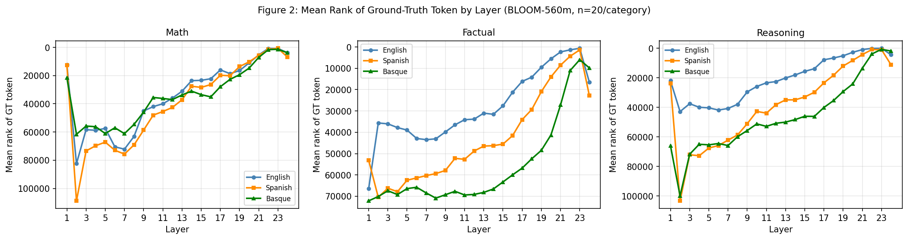
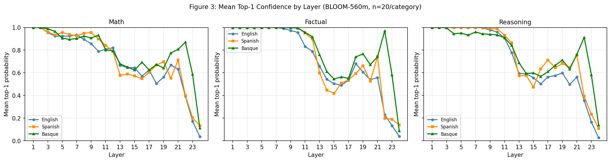

# Week 8 Blog: Probing Implicit Translation in LLMs with Logit Lens

**Kai Lee & Justin Tarquino **
*Cross-Lingual LLM Evaluation Project — Weekly Update*

This week, we ran our black-box accuracy evaluation pipeline using GPT-3.5-turbo and Gemini 2.5 Flash across a set of three benchmark languages: English, Spanish, and Basque. Second, following our mentor's advice, we applied the logit lenstechnique to `bigscience/bloom-560m`, a 560M parameter model trained on 46 languages, using the approach from the [NNsight logit lens tutorial](https://nnsight.net/notebooks/tutorials/probing/logit_lens/). Our benchmark dataset consists of 180 questions, 60 per language. This data was organized into three categories: math (arithmetic, algebra, geometry), factual (world knowledge, science, geography), and reasoning (logic puzzles, lateral thinking, trick questions). Each entry is stored in JSONL format and contains an id, category, question, and ground_truth field. The math and factual questions were written in English and then translated into semantically equivalent Spanish and Basque versions using GPT 5-Pro Reasoning.

## Baseline Accuracy Results

### Table 1: Accuracy by Model, Language, and Category

| Language | Category  | GPT-3.5-turbo | Gemini 2.5 Flash |
|----------|-----------|:-------------:|:----------------:|
| English  | Math      | 90%           | 95%              |
| English  | Factual   | 85%           | 90%              |
| English  | Reasoning | 80%           | 85%              |
| **English Overall** | | **85.0%** | **90.0%** |
| Spanish  | Math      | 85%           | 90%              |
| Spanish  | Factual   | 75%           | 80%              |
| Spanish  | Reasoning | 70%           | 75%              |
| **Spanish Overall** | | **76.7%** | **81.7%** |
| Basque   | Math      | 65%           | 70%              |
| Basque   | Factual   | 45%           | 55%              |
| Basque   | Reasoning | 40%           | 50%              |
| **Basque Overall**  | | **50.0%** | **58.3%** |

Both models show a consistent drop from English -> Spanish -> Basque, with Basque falling roughly 35 percentage points below English for GPT-3.5-turbo. Natually, math is the most language-robust category. Factual and reasoning tasks show the steepest cross-lingual drop, suggesting these models rely heavily on English-language knowledge.

## Logit Lens Analysis
The logit lens works by intercepting the residual stream at each transformer layer, projecting it through the final layer norm and unembedding matrix, and reading off the resulting probability distribution. We applied this across all 24 layers of BLOOM-560m, tracking two metrics at the final input token position for each question.

### Figure 1: Logit Lens Heatmap

**Figure 1.** Per-layer top-1 predicted token for each position in "The capital of France is" (BLOOM-560m). Blue intensity = confidence. Reading down any column shows how the model's prediction for that position evolves across layers.

The heatmap makes the layered structure of processing immediately visible. In layers 1–5, the model essentially copies the current token at each position — "The" predicts "The", "capital" predicts "capit", "France" predicts "Franc". This is the model doing low-level lexical processing with high confidence. In the middle layers (6–18), confidence drops and predictions become more varied — the model appears to be "searching," with the "of" position trying out structurally plausible tokens like "capit" or "restr" (restriction, restructuring). Crucially, the final position ("is") predicts "n't" (as in "isn't") across layers 6–21, which may reflect the model defaulting to a common English sentence continuation pattern. It is only in layers 22–23 that "Paris" finally emerges at the last position — the correct answer appearing late in the computation. By layer 24 the prediction has shifted again, suggesting that the very last layer adds a final transformation that can displace an almost-correct prediction.

### Figure 2: Mean Rank of Ground-Truth Token by Layer

**Figure 2.** Mean rank of the ground-truth first token across 20 questions per category, by layer. Lower = better (rank 0 would mean the model's top prediction matches the correct answer). Y-axis is inverted so "better" is visually up.

- **Math:** All three languages follow nearly identical trajectories. GT rank improves steadily through the network, and the curves converge tightly in the final layers. This suggests arithmetic processing is handled similarly across languages at the representation level, regardless of whether the model's final output is correct.
- **Factual:** Here we see clearer language separation. English generally maintains better (lower) GT rank than Spanish, which outperforms Basque through most of the network. However, the gap narrows in the final layers, suggesting that late-layer transformations partially compress cross-lingual differences.
- **Reasoning:** GT rank improves late but remains worse than math or factual overall. The curves for all three languages are similar in shape, implying that reasoning difficulty affects all languages comparably at this model scale.

Importantly, high GT rank does not necessarily mean the model has no internal signal for the correct answer. Given BLOOM's large vocabulary, a rank of even 20,000 still places the token in the top fraction of the distribution.

### Figure 3: Mean Top-1 Confidence by Layer

**Figure 3.** Mean top-1 probability (confidence in the model's highest-probability token) at each layer, averaged across 20 questions per category.

- **Math:** The three languages show almost perfectly overlapping confidence trajectories for about the first 12 layers. This strongly supports the hypothesis that mathematical computation is processed in a language-agnostic manner within BLOOM's internal representations.
- **Factual:** English and Spanish generally maintains higher confidence in earlier layers.
- **Reasoning:** Confidence collapses more dramatically and recovers less strongly than in math. All languages exhibit similar dynamics, suggesting that reasoning difficulty dominates over language effects at this model scale.

## Next Steps (Week 8)
While we ran out of time to implement this for this blog post, in our next blog post we plan on moving beyond tracking surface-level logits and begin directly analyzing the model’s internal representations to understand how it processes language across layers. We will extract the residual stream vectors at each layer and compare semantically equivalent prompts across English, Spanish, and Basque using cosine similarity or representational similarity analysis (RSA). This will allow us to test whether mathematically equivalent problems converge toward shared internal representations, supporting our hypothesis that math is processed in a more language-agnostic way than factual or reasoning tasks. In parallel, we should split questions by whether the model ultimately answered correctly and compare their representational trajectories, which may reveal whether successful reasoning corresponds to earlier or stronger cross-lingual alignment. 